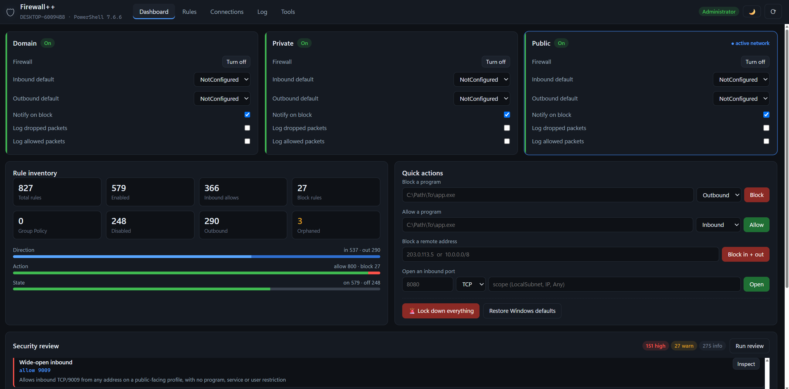

<div align="center">


### Your Windows Firewall deserves a real interface.

`wf.msc` was designed in 2006. You're still using it.<br>
**Firewall++** replaces it with a fast, searchable, local web console -<br>
no install, no dependencies, just one script.

<br>

```
powershell -ExecutionPolicy Bypass -File .\Start-Firewall++.ps1
```

</div>

<br>

---

> # 🎯 Why Firewall++?

> **Imagine this:**
> You just deployed a Windows server. Something is phoning home - you don't know what, you don't know where. You open `wf.msc`, and you're greeted with **800 rules**, no search bar, no process info, and no way to tell if port 3389 is open to the entire internet.
>
> You spend 20 minutes scrolling. You right-click 30 rules one by one. You still can't find the problem.
>
> **Now imagine this:**
> You run *one command*. A clean web console opens in your browser. You search "3389" - instant results. You see every live connection, which process owns it, and block it in one click. A security audit runs automatically and tells you exactly what's exposed. You export a backup, lock things down, and move on with your day.
>
> **That's Firewall++.** No install. No dependencies. No cloud. Just your firewall, finally under control.
>
>

<br>

---

> # 📌 Quick tab overview

| Tab | What it does |
|:--|:--|
| [📊 **Dashboard**](#-dashboard) | Live status of all three firewall profiles (Domain / Private / Public), rule inventory bars, quick-action shortcuts, and the automated security review. Your command centre. |
| [📋 **Rules**](#-rules--search-everything-edit-anything) | Every firewall rule in one searchable, sortable, filterable table. Toggle, edit, bulk-change, or delete rules without opening a single dialog. |
| [🌐 **Connections**](#-connections--live-socket-view) | Real-time view of every active TCP/UDP socket, the process that owns it, and one-click controls to block the program or remote address. |
| [📝 **Log**](#-log--firewall-log-viewer) | Parsed `pfirewall.log` (dropped packets), newest first. Enable logging with one button and block suspicious addresses straight from log entries. |
| [🧪 **Tools**](#-tools) | Connectivity simulator, policy backup & export (JSON / CSV / PowerShell), and a full change history of every action taken through this console. |

<br>

---

> # ⚡ Get started

**One command. No install. No dependencies.**

```powershell
powershell -ExecutionPolicy Bypass -File .\Start-Firewall++.ps1
```

The script prompts for elevation (firewall changes need Administrator), then opens your browser automatically. Press **Ctrl+C** to stop.

> [!TIP]
> Don't want to elevate? Decline the UAC prompt - the console still loads in **read-only mode**. Everything is browsable; writes are simply refused with a clear message.

| Flag | What it does |
|:--|:--|
| `-Port 9001` | Bind to a different port |
| `-NoElevate` | Skip the UAC prompt (read-only) |
| `-NoBrowser` | Print the URL instead of opening it |

> [!NOTE]
> If the default port (8777) is already in use, the launcher automatically picks the next available port and opens the browser to the correct URL.

<br>


## 🧰 Features

> # 📊 Dashboard

All three profiles - **Domain**, **Private**, **Public** - on one screen. See which network you're on right now, toggle firewalls, inspect default actions, notification settings, and logging. Inventory bars show rule counts at a glance.

#### ⚙️ Quick actions

Do in one click what takes five screens in `wf.msc`:

- ✅ **Allow a program** - pick the `.exe`, done
- 🚫 **Block a program** - instant
- 🌐 **Block a remote address** - both directions, one click
- 🔓 **Open an inbound port** - with profile scoping
- 🔒 **Lock down** - set every profile to block-by-default (inbound *and* outbound)
- 🔄 **Restore defaults** - back to factory Windows policy

#### 🛡️ Security review

An automated audit of your rule set that catches what humans miss:

| Check | What it flags |
|:--|:--|
| **Wide-open inbound allows** | No program, no service, no package, no user scope - just *allow anything* |
| **Sensitive port exposure** | SMB, RDP, RPC, MSSQL, MongoDB, Redis, and more |
| **Edge traversal risks** | Rules accepting unsolicited traffic via NAT/Teredo |
| **Stale rules** | Programs that no longer exist on disk |
| **Duplicate rules** | Identical match criteria - clutter that hides intent |

> [!IMPORTANT]
> Most Windows machines have at least a few findings. Running the review once is worth it.

---

> # 📋 Rules - search everything, edit anything

Every firewall rule in **one searchable, sortable, filterable table**.

- 🔍 **Free-text search** across names, programs, ports, and addresses
- 🏷️ **Filter** by direction, action, enabled state, profile, and group
- 🔀 **Inline toggle** - enable or disable a rule without opening anything
- ✏️ **Full editor** - ports, addresses, program, service, interface type, edge traversal, profile membership
- ☑️ **Bulk operations** - select many, then enable / disable / allow / block / delete in one go
- 🏛️ **Group Policy awareness** - GPO rules are marked read-only and protected
- 📌 **Store filter** - switch to *Effective* to see the merged GPO + local policy actually in force

---

> # 🌐 Connections - live socket view

Every TCP and UDP socket, with:

- Owning **process name** and full image path
- Remote address and port
- One-click **block the program** or **block the address**

See what's talking. Stop what shouldn't be.

---

> # 📝 Log - firewall log viewer

Parsed `pfirewall.log`, newest first, fully filterable.

- One button to **enable dropped-packet logging** across all profiles (16 MB cap)
- **Block an address** directly from a log line

---

> # 🧪 Tools

| Tool | Description |
|:--|:--|
| **Connectivity simulator** | Pick direction, profile, protocol, port, address, and program - get the verdict with every contributing rule listed in precedence order. Rules scoped to fields you left blank are reported as *skipped*, keeping the answer honest. |
| **Backup & export** | One-click `.wfw` policy backup (restorable from the same page). Export all rules to **JSON**, **CSV**, or a runnable **PowerShell script**. |
| **Change history** | Every modification this console has made - user, timestamp, and what changed. |

<br>

---

> # 🔐 Project security

Firewall++ is designed to be safe by default:

| Layer | Protection |
|:--|:--|
| **Network** | Binds to `127.0.0.1` only - nothing is reachable from the network |
| **Auth** | 128-bit token minted per launch, passed in the URL *fragment* (never in request lines or logs). Sent as `X-FW-Token` on every API call via `sessionStorage`. |
| **DNS rebinding** | Rejected unless `Host` header matches the expected value |
| **Cross-origin** | Rejected if `Origin` header doesn't match - no hostile page can drive the API |
| **Path traversal** | Static file serving is confined to `web/` by explicit allowlist check |
| **Read-only mode** | Without Administrator rights, every mutating call is refused server-side |
| **Destructive ops** | Turning off a firewall, deleting rules, restoring backups, lock-down, and opening ports to `*` all require confirmation in the UI |

<br>

---

> # 📌 Good to know

- The first load indexes every rule (**~6 s** for 800 rules) and caches for two minutes. The launcher warms the cache before opening your browser. Any change invalidates the cache immediately.
- The rules table paints **300 rows** at a time with a *show more* link - use filters for large rule sets.
- Group Policy rules are **read-only by design** - edit them in the GPO.
- `Get-NetFirewallRule` reports AppContainer/package scope inconsistently across Windows builds. Where a package scope is present, it's treated as a real restriction - store-app rules won't be misreported as wide open.

<br>

---

<div align="center">

**Firewall++** - because your firewall shouldn't need a 20-year-old MMC snap-in.

</div>
